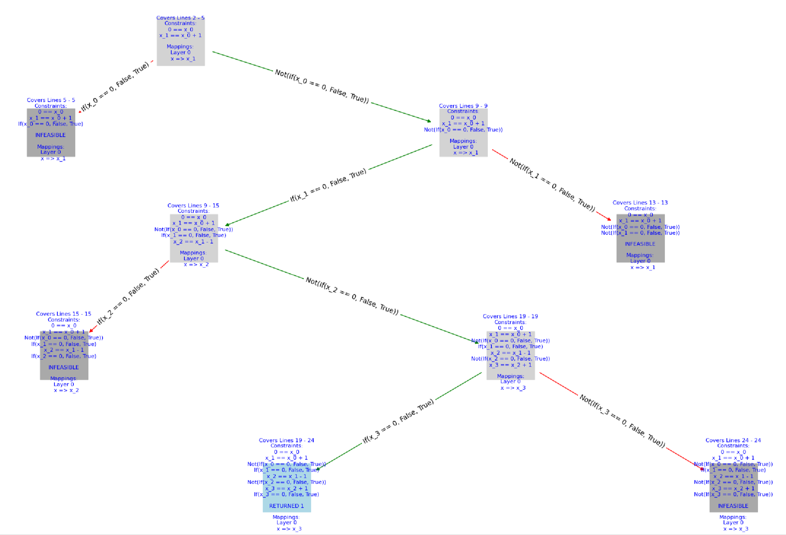

# Introduction
This is a symbolic execution engine written in python that can symbolically execute a small portion of the C language (A singular function including int, while, if, else). Symbolic execution is a static analysis tool in cyber security that determines whether a point in code can be reached and what inputs are needed to reach it all while never needing to run the code.

Our implementation uses tree sitter to parse the abstract syntax tree of a singular function written in C and then walks through the function accumulating constraints on variables that must be true to reach that point in the program. The Z3 library is then used to determine if those constraints are unsatisfiable (Ex: x > 10 && x < 10) or satisfiable. If a line with "return 1" is satisfiable to reach, we also use Z3 to get possible assignments of the function's arguments needed to reach that line.

See `test_logs/*` for examples of the program in action. 

Example Output:


Assignment: https://www.cs.montana.edu/revelle/csci591/assignments/03/

# Setup

```sh
pip install tree-sitter tree-sitter-c z3-solver

# for plotting:
#sudo apt install graphviz
sudo apt install python3-tk
sudo apt install libgraphviz-dev

pip install pygraphviz networkx matplotlib 
```

# Usage

```sh
# to test the function 'test' in a c file:
python runner.py ./tests/real_test.c test

# to run one of our builtin tests
python test_while.py
```


# Layout
- `interpreter.py` The main file with all the interpreter logic.
- `runner.py` The file that takes command line args to open a C file and run it with the interpreter.
- `test_*.py` are python files that run a specific test of C code.


# Misc

See docs:
https://github.com/tree-sitter/py-tree-sitter
https://ericpony.github.io/z3py-tutorial/guide-examples.htm

## Tree Sitter Node Usage
```python
# you can print the structure (the type of a node and its named children)
print(node)

# you can print the text of a node (it returns bytes so call .decode() to convert it back to a string)
print(node.text.decode())

# you can jump to named children with this function:
myPotatoNode = node.child_by_field_name('potato')

# A Node in treesitter has children you can iterate over. 
# This includes both the named children seen above and any unnamed children
for child in node.children:
    print(child)

# get the first child
firstChild = node.children[0]

# you can get the next sibling or parent of nodes too
theNextNode = node.next_sibling
theParentNode = node.parent

```
